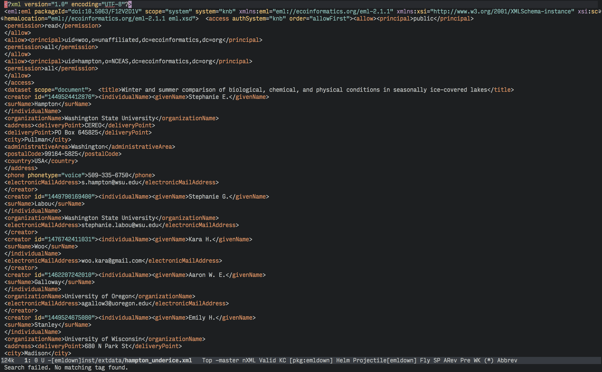
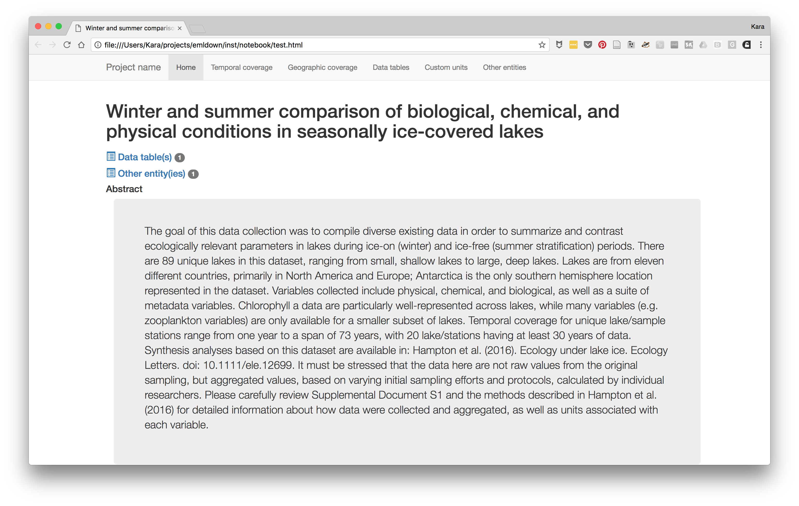
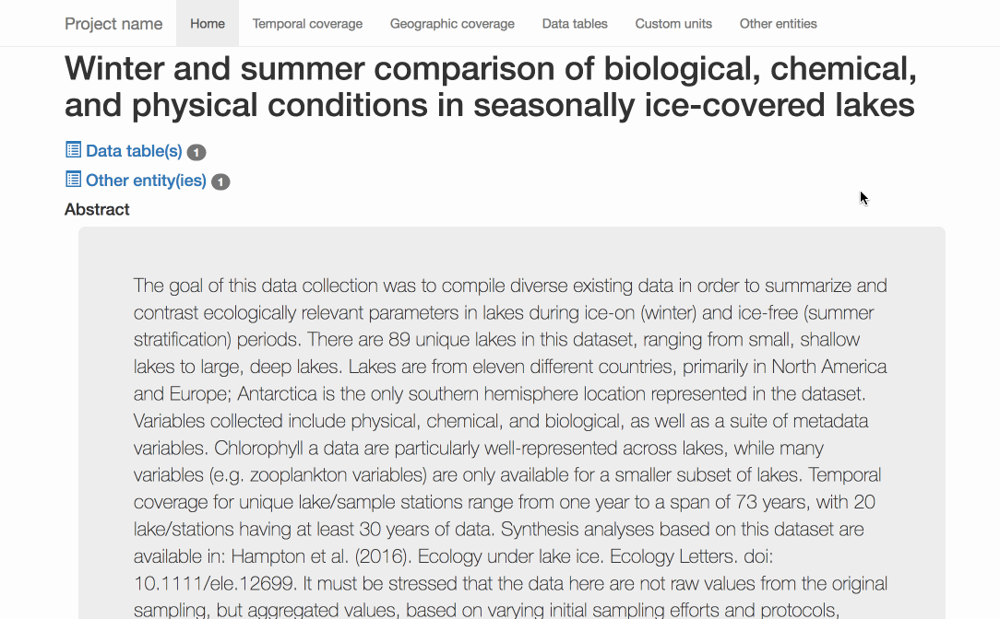
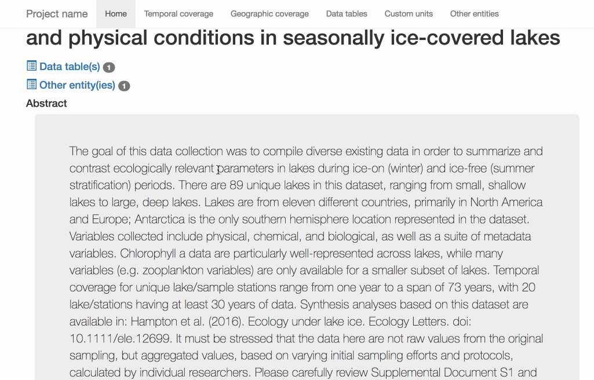

# emldown

*emldown* is a package for creating a helpful website based on EML metadata.

This is a project of
the [rOpenSci unconference](https://github.com/ropensci/unconf17/issues/28).

Usage:

```R
devtools::install_github("ropenscilabs/emldown")
library("emldown")
render_eml(system.file("extdata", "hampton_underice.xml", package = "emldown"))
```

## Illustration

Raw EML file: :anguished: :weary: :unamused:



With `emldown`: :relieved: :satisfied: :sunglasses:



## Working example

A quick [example website](http://aammd.info/emldown/test.html)

## Gifs

The resulting website is based on [Bootstrap](https://getbootstrap.com/) and has some interactive components:



Geographic information turns into a map, made using [leaflet](https://rstudio.github.io/leaflet/):



Right now, we are able to capture some of the most common parts of Ecological Metadata Language, including the Title, Abstract, Authors, Keywords, Coverage (where in space and time the samples were taken), the Data Tables and Units associated with these.

